<!-- guardian:skip -->
<!-- Outbound URLs verified HTTP 200 on 2026-09-25. LinkedIn returns 999 to bots by design. -->
<picture>
  <source media="(prefers-color-scheme: dark)" srcset="./banner-dark.svg">
  <source media="(prefers-color-scheme: light)" srcset="./banner-light.svg">
  
</picture>

### What I work on

I build retrieval and automation systems, run them in production, and write the
documentation that lets somebody else operate them without me. Before software I spent
ten years in healthcare claims and commercial insurance, which is why I care more about
what a system does when it fails than what it does in the demo.

| | |
|---|---|
| **AI systems** | Retrieval augmented generation, agent workflows, custom MCP servers, prompt and context engineering, evaluation and guardrails |
| **Languages** | Python, JavaScript, TypeScript, PHP, SQL, HTML and CSS |
| **Building on** | WordPress theme and plugin development, React, React Native with Expo, Next.js, Supabase, Vercel |
| **Data** | MySQL including full-text indexing, PostgreSQL, SQLite. Schema design, migrations, and write paths that refuse to lose a record |
| **Integration** | REST APIs, the Claude and OpenAI APIs, Gemini, Stripe webhooks, the Meta, X and YouTube APIs through Publer, n8n, Zapier |
| **Models** | Claude, GPT, Gemini. Llama and Kimi run locally for work that should not leave the machine |
| **Daily** | Claude Code, OpenAI Codex, Gemini CLI, Git, VS Code |

### Things you can open

**[The Human Algorithm](https://mstimaj.com)** — Artificial intelligence explained in plain
language for people with no technical background. Forty-four articles, each shipping with an
interactive machine the reader can break.

**[Portfolio](https://fatimajalloh.com)** — A retrieval system you can type into, running over
my published writing, with the architecture shown and the failure that set the rules.

**[Claude Code CLI Cheatsheet](https://github.com/MsTimaj/Claude_Code_CLI_Cheatsheet)** — A
beginner guide to running an AI agent in a terminal, for people who have never used one.

**[n8n](https://github.com/MsTimaj/n8n-mstimaj-simpleflows)** and
**[Zapier](https://github.com/MsTimaj/zap-mstimaj-simpleflows) simple flows** — Working
automations kept small enough to lift and adapt rather than study.

### How I think about it

> A demo and a Tuesday are different kinds of things. One runs once, for you, with the good
> input. The other runs every day, for strangers, on a budget, and has to fail in a way
> somebody can see.

I learned that the hard way. An assistant I built kept returning confident, generic answers
for days after its model API had failed. Nothing alerted, and every health check was green.
Whether a process ran and whether its output was correct are two different questions, and only
one of them was being asked. So now the guardrail goes in before the feature.

### Elsewhere

[mstimaj.com](https://mstimaj.com) · [fatimajalloh.com](https://fatimajalloh.com) ·
[LinkedIn](https://www.linkedin.com/in/fatima-jalloh1) ·
[connect@mstimaj.com](mailto:connect@mstimaj.com)

Fatima Jalloh · Mstimaj Tech and AI LLC · Connecticut · B.S. Information Technology,
Sacred Heart University · Google AI Professional Certificate
